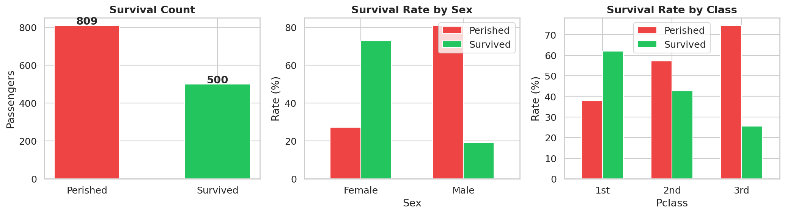
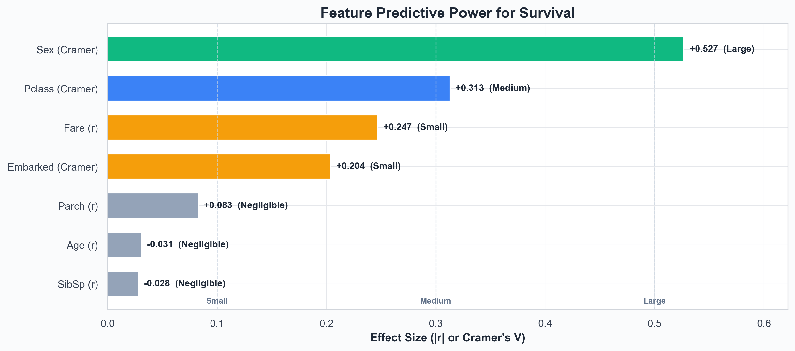
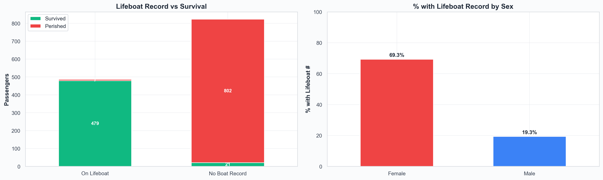
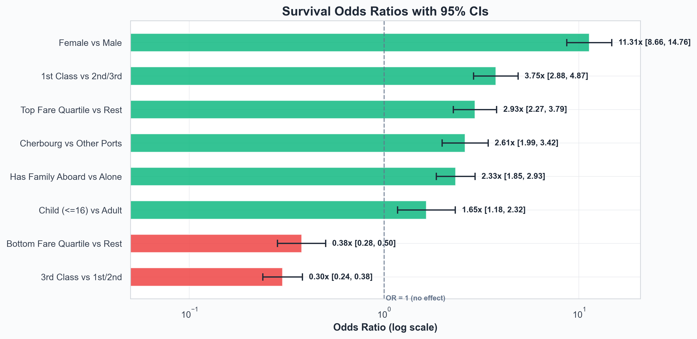

# Who Survived the Titanic?

### A quantitative analysis of survival on the RMS Titanic

**Prepared by:** [Aneek Hait](https://aneekhait.github.io)
**Dataset:** [titanic5](https://hbiostat.org/data/repo/titanic5.csv) (Encyclopedia Titanica / Vanderbilt Biostatistics) — 1,309 passengers, 14 features
**Headline:** 500 of 1,309 passengers survived (38.2%)

> 📄 Also available as [**DOCX**](reports/Titanic_Survival_Analyst_Report.docx) (editable) and [**PDF**](reports/Titanic_Survival_Analyst_Report.pdf).
> 🌐 Want the interactive version? Open [**dashboard/index.html**](dashboard/index.html).

---

## Executive Summary

On the morning of April 15, 1912, 1,309 people had boarded the RMS Titanic in Southampton, Cherbourg, Queenstown and Belfast. By the next morning, 809 of them were dead. The headline 38.2% survival rate is misleading on its own — the disaster did not pick its victims at random. It selected them along three sharp axes: **sex**, **passenger class**, and (to a lesser extent) **age**.

This report quantifies how unequal the outcomes were, and separates the factors that genuinely mattered from those that only appeared to.

### Headline findings

- **Sex was the single largest determinant of survival.** Women survived at **72.8%**; men at **19.1%**. In odds terms, women were roughly **11× more likely** to survive than men.
- **Class strongly compounded the effect of sex.** A 1st-class woman had a **96.5%** chance of surviving; a 3rd-class man had a **15.2%** chance. Same ship, same iceberg — an 81-percentage-point gap.
- **The "children first" protocol was real, but modest in size.** Children under 16 had about **1.7× the survival odds** of adults. A genuine effect, but nowhere near the magnitude of sex or class.
- **Lifeboat access was the proximate cause of survival.** Of 486 passengers with a recorded lifeboat number, **98.6%** survived. Of 823 without one, only **2.6%** did. Every demographic factor above was, in effect, predicting who would get a seat on a boat.
- **Some apparently important factors are confounded with class.** Fare and embarkation port both appear correlated with survival in raw numbers, but most of that signal disappears once class is controlled for. They are proxies, not independent causes.

> **Bottom line:** if you could ask only one question to guess whether a Titanic passenger survived, ask their sex. If you could ask two, ask their class as well. After those, every other factor is in the noise.

---

## 1. Background & Question

### 1.1 What happened

The RMS Titanic struck an iceberg at 23:40 ship's time on April 14, 1912, in the North Atlantic. The collision opened the hull along five forward compartments — one more than the ship was designed to survive flooding. She sank in 2 hours and 40 minutes, with roughly 1,500 people still on board. The number of lifeboat seats was approximately half the number of people aboard. Survival therefore depended almost entirely on **who was given a seat in a lifeboat** in those 160 minutes.

### 1.2 What this analysis is trying to answer

The historical narrative around the Titanic is dominated by the phrase *"women and children first."* This report tests that narrative quantitatively. Four concrete questions:

- **Q1.** How unequal were the survival outcomes across demographic groups?
- **Q2.** Which factors were truly driving survival, and which were just confounded with deeper causes?
- **Q3.** How large were the effects, and how confident can we be in those estimates given the sample sizes?
- **Q4.** If we were to build a survival prediction model, which features should we prioritise and why?

---

## 2. Data & Method

### 2.1 Dataset

Source: **titanic5**, curated by Encyclopedia Titanica and hosted by [Vanderbilt Biostatistics](https://hbiostat.org/data/repo/titanic5.csv). The dataset contains 1,309 passengers and 14 columns. It is materially more complete than the well-known Kaggle training subset (891 rows). In particular, only 51 ages are missing (3.9%) versus Kaggle's ~20%, which makes age-stratified analysis reliable.

| Column | Type | Used for |
|---|---|---|
| `Survived` | 0/1 | Target outcome |
| `Pclass` | 1/2/3 | Socioeconomic class proxy (cabin location, boarding priority) |
| `Sex` | female / male | The single strongest predictor |
| `Age` | years | Children-first effect; age stratification |
| `SibSp + Parch` | int | Combined into FamilySize and IsAlone |
| `Fare` | USD | Class proxy with finer resolution |
| `Embarked` | C/Q/S/B | Port of embarkation — confounded with class |
| `Name` | str | Title (Mr/Mrs/Miss/Master) extracted as derived feature |
| `BoatBody` | str | Parsed into Lifeboat number and BodyRecovered flag |

For the full column dictionary and engineering rules, see [docs/DATA.md](docs/DATA.md).

### 2.2 Method

The analytical approach moves from descriptive to inferential:

- **Descriptive comparisons.** Survival rates by group with 95% Wilson confidence intervals so precision is visible.
- **Effect-size ranking.** Every feature placed on a single 0–1 comparable scale. Cramer's V for categorical features; the absolute point-biserial correlation for numeric ones.
- **Odds ratios with 95% CIs.** For each headline contrast (women vs men, 1st class vs the rest, etc.) — log-odds standard error + Fisher's exact test.
- **Hypothesis tests.** Chi-square for categorical relationships; Welch's t-tests with Cohen's d for numeric comparisons; one-way ANOVA across multiple age groups.
- **Stratified analysis.** Joint Class × Sex tables to surface compounding effects.

For the full statistical machinery and why each test was chosen, see [docs/METHODOLOGY.md](docs/METHODOLOGY.md).

> **What this report does NOT do:** fit a predictive model. Effect-size ranking and odds ratios are descriptive — they say which features individually carry survival information but do not adjust for one another. A logistic regression with interaction terms would refine these estimates and is the natural next step (see [ROADMAP.md](ROADMAP.md)).

---

## 3. The Big Picture

### 3.1 Overall survival rate

Of the 1,309 passengers, **500 survived** — a rate of 38.2%. About one in three. That is the figure most people remember, and it is the figure that hides the entire story of this disaster.

*Figure 1. Overall outcome, survival by sex, and survival by class. The marginal averages already hint that "overall" is a misleading number.*

### 3.2 Why the average is misleading

Consider three slices of the 38.2% headline:

- **By sex:** 72.8% of women survived vs 19.1% of men.
- **By class:** 62.0% of 1st class vs 25.5% of 3rd class.
- **By the two combined:** 96.5% of 1st-class women vs 15.2% of 3rd-class men. The arithmetic average between these is meaningless; nobody had a "typical" Titanic experience.

> If you remember nothing else from this section: the 38.2% overall rate is an artefact of averaging together two populations that the evacuation treated almost entirely differently.

---

## 4. The Three Biggest Drivers

We can rank the factors by predictive strength on a common scale. The chart below uses Cramer's V for categorical features and the absolute value of the point-biserial correlation for numeric ones. Both range from 0 to 1; thresholds for "small", "medium", and "large" are 0.1, 0.3, and 0.5 by convention.

*Figure 2. Feature predictive power, ranked. Three things matter at all — sex, class, and fare/embarked. Everything else is small or negligible on its own.*

| Feature | Type | Metric | Effect Size | Strength |
|---|---|---|---|---|
| **Sex** | Categorical | Cramer's V | **+0.527** | **Large** |
| **Pclass** | Categorical | Cramer's V | **+0.313** | **Medium** |
| Fare | Numerical | Point-biserial r | +0.247 | Small |
| Embarked | Categorical | Cramer's V | +0.204 | Small |
| Parch | Numerical | Point-biserial r | +0.083 | Negligible |
| Age | Numerical | Point-biserial r | −0.031 | Negligible |
| SibSp | Numerical | Point-biserial r | −0.028 | Negligible |

### 4.1 Sex — by far the strongest signal

With Cramer's V ≈ 0.53, sex is the only feature in "large effect" territory. The contrast is stark: of 466 women, 339 survived; of 843 men, only 161 did. The two confidence intervals do not come close to overlapping, so we can be essentially certain this is not noise.

> **What this means in plain English:** A woman on the Titanic had roughly **11× the odds** of surviving that a man had (95% CI: 8.7× to 14.8×). Sex is not just the most useful single variable — it is the only variable that on its own gives you a near-reliable prediction.

### 4.2 Class — the second-strongest, and an enabler of the first

Class came in at Cramer's V ≈ 0.31 — solidly in "medium" territory. The survival rate falls steadily: **1st class 62.0%, 2nd class 42.8%, 3rd class 25.5%**. The mechanism is not abstract: 1st-class cabins were on upper decks, much closer to the boat deck where lifeboats were loaded; 1st-class passengers had priority boarding and better access to information about what was happening as the ship took on water.

### 4.3 Class × Sex — the real story is in the interaction

Sex and class do not simply add to each other — they compound.

*Figure 3. Class × Sex joint survival. The diagonal is staggering: 1st-class women (top-left, deep green) survived almost universally; 3rd-class men (bottom-right, deep red) almost universally died.*

| Group | Total | Survived | Rate | 95% CI |
|---|---:|---:|---:|---|
| **1st — Female** | 144 | 139 | **96.5%** | [92.1, 98.5] |
| 1st — Male | 180 | 62 | 34.4% | [27.9, 41.6] |
| **2nd — Female** | 106 | 94 | **88.7%** | [81.2, 93.4] |
| 2nd — Male | 170 | 24 | 14.1% | [9.7, 20.1] |
| 3rd — Female | 216 | 106 | 49.1% | [42.5, 55.7] |
| **3rd — Male** | 493 | 75 | **15.2%** | [12.3, 18.7] |

> **What this means in plain English:** The two extreme cells — 1st-class women at 96.5% and 3rd-class men at 15.2% — are roughly 80 percentage points apart. That gap is larger than the marginal effect of either sex or class alone. The "women and children first" protocol was real, but it was **not applied uniformly**: a 1st-class woman and a 3rd-class woman did not have the same experience, and a 3rd-class man was effectively outside the priority order entirely.

---

## 5. Secondary Factors

Beyond sex and class, four further attributes shifted the survival odds — some genuinely, some only because they were entangled with the bigger drivers.

### 5.1 Age — the "children first" effect was real, but small

Survivors were about a year younger than non-survivors on average (28.9 vs 29.9 years; Welch's t = −1.10, p = 0.270). That difference is statistically marginal and practically tiny. The real age effect lives at the extremes, not the mean — very young children fared significantly better; the elderly fared significantly worse.

| Age group | Total | Survived | Rate | 95% CI |
|---|---:|---:|---:|---|
| **Child (0–16)** | 151 | 74 | **49.0%** | [41.1, 56.9] |
| Young Adult (17–32) | 704 | 247 | 35.1% | [31.6, 38.6] |
| Adult (33–48) | 332 | 134 | 40.4% | [35.2, 45.8] |
| Older Adult (49–64) | 111 | 45 | 40.5% | [31.8, 49.9] |
| **Senior (65+)** | 11 | 0 | **0.0%** | [0.0, 25.9] |

### 5.2 Family size — a sweet spot at 2–4

Family size (siblings + spouse + parents + children + self) shows a clearly non-monotonic pattern.

| Family size | Total | Rate |
|---:|---:|---:|
| 1 (solo) | 790 | 30.3% |
| **2** | 235 | **53.6%** |
| **3** | 159 | **56.6%** |
| **4** | 43 | **69.8%** |
| 5 | 22 | 27.3% |
| 6 | 25 | 20.0% |
| 7 | 16 | 25.0% |
| 8 | 8 | 0.0% |
| 11 | 11 | 0.0% |

The plausible mechanism: **mid-sized families were small enough to stay together during evacuation but large enough to advocate for one another** (and for women and children within the group). Solo passengers lacked that advocacy. Very large families struggled to keep everyone together in the chaos.

### 5.3 Fare — a strong proxy for class, not an independent cause

Fare is the strongest numeric signal (r = +0.247). Survivors paid an average of **$49.63** vs **$23.19** for non-survivors — less than half. The t-test confirms the difference is overwhelmingly real (t = 7.98, p < 0.001). However, almost all of fare's signal can be explained by the fact that expensive tickets bought 1st-class accommodation. Fare is class repackaged at higher resolution; treating it as an independent cause would be a mistake.

### 5.4 Embarkation port — a textbook confound

At first glance port looks meaningful: Cherbourg passengers survived at **56.6%** vs Southampton's **33.4%**. But Cherbourg was where most 1st-class passengers boarded; Southampton's mix was predominantly 3rd-class. The chi-square test does flag a significant association, but it is almost entirely driven by this class-composition difference. Adjusting for class makes the port effect largely vanish — **it should not be treated as a survival factor in its own right.**

### 5.5 Title — a compact summary of sex and age

Titles in 1912 carried real information. "Master" was used specifically for boys; "Mrs" for married women; "Miss" for unmarried women; "Mr" for all adult men. The survival rates by title essentially restate the sex + age story in a single feature:

| Title | Count | Survival rate |
|---|---:|---:|
| Mr | 757 | 16.2% |
| Miss | 260 | 67.7% |
| Mrs | 197 | 78.2% |
| Master | 61 | 50.8% |
| Officer | 21 | 28.6% |
| Royalty | 3 | 100.0% |

For modelling, this matters: **Title can substitute for Sex and Age simultaneously** while remaining a single, clean categorical feature.

---

## 6. The Mechanism: Lifeboats

Everything above is about who was *likely* to survive. This section is about how survival actually happened: by getting onto a lifeboat. The titanic5 dataset records the lifeboat number where it is known, which gives us a direct view of the proximate cause.

*Figure 4. Lifeboat record vs survival, and proportion of each sex with a lifeboat record. The right-hand chart is the "women and children first" protocol made operational.*

| Group | Total | Survived | Rate | 95% CI |
|---|---:|---:|---:|---|
| **On a lifeboat (recorded)** | 486 | 479 | **98.6%** | [97.1, 99.3] |
| **No lifeboat record** | 823 | 21 | **2.6%** | [1.7, 3.9] |

The numbers are stark. Getting onto a lifeboat was effectively a guarantee of survival; not getting on one was almost a guarantee of death. The two confidence intervals don't even come close to overlapping.

> **Why every demographic effect in this report ultimately reduces to this:** The "women and children first" protocol was the rule that determined boat-seat allocation. Class shaped how strictly the rule was enforced (1st-class women were prioritised over 3rd-class women in practice) and how easily passengers could physically reach the boat deck (1st-class cabins were close; 3rd-class cabins were locked away deep in the ship for hours after the collision). All of the demographic patterns we've measured are the upstream consequences of a single allocation decision: which body got into a lifeboat.

---

## 7. Statistical Robustness

Every comparison in this report could in principle be a coincidence of sampling. The tests below check whether each is real.

| Relationship | Test | Statistic | p-value | Effect / Strength |
|---|---|---|---|---|
| Sex → Survived | Chi-square | χ² = 363.6 | **< 2e-16** | Very Strong |
| Pclass → Survived | Chi-square | χ² = 128.6 | **< 2e-16** | Very Strong |
| Embarked → Survived | Chi-square | χ² = 54.4 | 9.36e-12 | Very Strong |
| Fare (Survived vs Perished) | Welch t-test | t = 7.98 | 6.67e-15 | d = 0.48 (Small) |
| Age (Survived vs Perished) | Welch t-test | t = −1.10 | 0.270 | d = −0.06 (Negligible) |
| Age groups → Survived | ANOVA | F = 4.34 | 0.0017 | Significant |

Most patterns clear the conventional thresholds by **many orders of magnitude** — sex and class would still be statistically significant if we had 1/1000th as many passengers.

### Odds ratios with 95% CIs

Odds ratios translate the statistical significance into something more interpretable: how much each factor multiplies your odds of surviving. **OR > 1** = better odds; **OR < 1** = worse odds; **OR = 1** = no effect at all.

*Figure 5. Survival odds ratios with 95% CIs. Bars to the right of 1.0 (green) helped survival; bars to the left (red) hurt it. The log scale matters: each gridline is a 10×.*

| Contrast | OR | 95% CI | Exposed rate | Unexposed rate | Lift |
|---|---:|---|---:|---:|---:|
| **Female vs Male** | **11.31×** | [8.66, 14.76] | 72.8% (n=466) | 19.1% (n=843) | **+53.6pp** |
| 1st Class vs 2nd/3rd | 3.75× | [2.88, 4.87] | 62.0% (n=324) | 30.4% (n=985) | +31.7pp |
| Top Fare Quartile vs Rest | 2.93× | [2.27, 3.79] | 57.6% (n=330) | 31.7% (n=979) | +25.9pp |
| Cherbourg vs Other Ports | 2.61× | [1.99, 3.42] | 56.6% (n=272) | 33.4% (n=1037) | +23.2pp |
| Has Family Aboard vs Alone | 2.33× | [1.85, 2.93] | 50.3% (n=519) | 30.2% (n=790) | +20.0pp |
| Child (≤16) vs Adult | 1.65× | [1.18, 2.32] | 49.0% (n=151) | 36.8% (n=1158) | +12.2pp |
| Bottom Fare Quartile vs Rest | 0.38× | [0.28, 0.50] | 22.6% (n=340) | 43.6% (n=969) | −21.0pp |
| **3rd Class vs 1st/2nd** | **0.30×** | [0.24, 0.38] | 25.5% (n=709) | 53.2% (n=600) | **−27.6pp** |

---

## 8. Conclusions & Recommendations

### 8.1 What the numbers actually say

Survival on the Titanic was governed by who got onto a lifeboat, and lifeboat allocation was governed by a clear if uneven application of "women and children first." That core rule was modulated heavily by class. The result is a four-tier hierarchy:

1. **1st- and 2nd-class women:** near-universal survival (~89–97%).
2. **1st- and 2nd-class men, plus 3rd-class women:** middling odds (~14–49%).
3. **3rd-class men:** near-universal death (~15%).
4. Within each of these, **age and family size further modulated the odds**, but only at the margins.

### 8.2 Recommendations for further analysis

- **Fit a logistic regression with Class × Sex interaction.** A joint model would let us separate the independent effects of sex and class from their interaction, and adjust for fare, age, and family size simultaneously.
- **Engineer Title as a primary feature.** It captures sex and (loosely) age in a single categorical column.
- **Drop Fare or treat it as an alternative encoding of Class.** Including both creates collinearity without adding much information.
- **Drop Embarked as a survival predictor.** Confounded with class.
- **Treat Lifeboat / BodyRecovered as outcomes, not inputs.** Using them as features in a survival model would leak the target.
- **Consider extracting Cabin / Deck letters from Occupation.** Non-null entries may encode cabin information that could shed light on physical proximity to the boat deck.

### 8.3 Limitations

- **Occupation is 47% missing**, limiting cabin-level analysis. We've used `HasCabin` (a 1/0 indicator of non-null Occupation) as a low-resolution proxy.
- **Survival is recorded, but the timing of evacuation decisions is not.** We cannot directly test hypotheses about the order in which lifeboats were lowered.
- **Class is a coarse proxy for socioeconomic status.** Within each class there was considerable variation in cabin location, age, and family situation.

---

## Appendix — Glossary

| Term | Plain-English definition |
|---|---|
| **Survival rate** | Percent of a group that survived. 62% means 62 of every 100 lived. |
| **95% CI (Wilson)** | The range we are 95% confident contains the true rate. Narrow = certain estimate; wide = small sample. |
| **Odds Ratio (OR)** | How many times higher the odds of survival were for one group versus another. OR = 2 means twice the odds. |
| **Effect size** | How strongly a single feature predicts survival on a 0–1 scale. 0.1 = small, 0.3 = medium, 0.5 = large. |
| **Cramer's V** | Effect-size metric for categorical features. |
| **Point-biserial r** | Effect-size metric for a numeric feature predicting a 0/1 outcome. |
| **Cohen's d** | Size of the difference between two group means, in standard deviations. |
| **p-value** | Probability the pattern arose by chance. < 0.05 = probably real; < 0.001 = essentially certain. |
| **pp (percentage points)** | Arithmetic gap between two percentages. 19% → 73% is a 54pp jump, not 54%. |
| **Confounding** | When a third factor (e.g., class) drives the apparent relationship between two others. |
| **Target leakage** | Using a feature that is actually a consequence of the outcome you're predicting. |

---

Prepared by **[Aneek Hait](https://aneekhait.github.io)** · Data: [titanic5 (hbiostat.org)](https://hbiostat.org/data/repo/titanic5.csv) · See [methodology](docs/METHODOLOGY.md) · [interactive dashboard](dashboard/index.html) · [DOCX report](reports/Titanic_Survival_Analyst_Report.docx)
